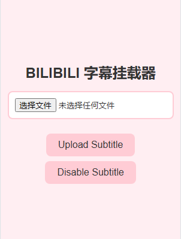
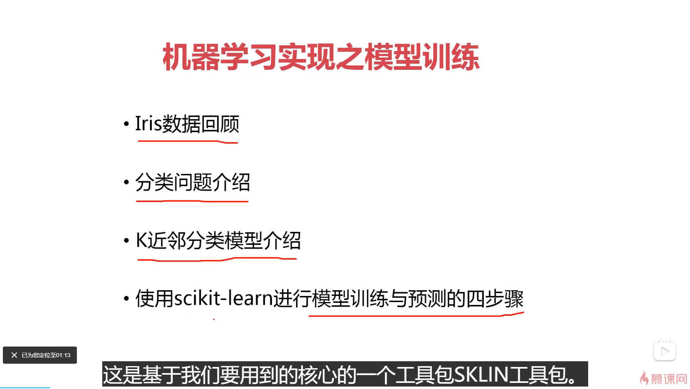

# Bilibili 字幕插件

## 功能介绍

这是一个谷歌插件，插件允许你在观看没有字幕的视频时上传自己的字幕文件。这样可以解决你在观看视频时没有字幕的困扰，尤其是在你倍速观看课程视频时，通过字幕可以更清晰地了解视频内容。

## 解决的问题

在观看一些课程视频时，特别是在倍速播放时，仅靠音频有时难以听清视频内容。而并不是每个教学视频都有官方的CC字幕。这个插件允许你上传自己的字幕，并在视频页面上挂载显示，从而提高观看体验和学习效率。你可以通过其他AI字幕应用来获得字幕文件，比如Whisper。

## 插件页面

## 插件显示出的字幕样式（视频下并没有CC字幕）

## 安装与使用

1. 打开谷歌浏览器点击右上角 扩展程序 - 管理扩展程序，然后检查左上角有 “加载已解压的扩展程序”。
2. 点开一个视频，这里假设你已经拥有字幕文件
3. 在拓展程序（插件）中找到Bilibili Subtitle Importer 1.0
4. 选择你的字幕文件后点击 Upload Subtitle
5. 如果没有错误，那么视频中应该会显示出你的字幕

===